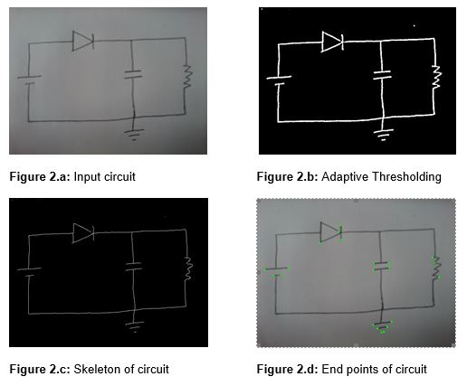
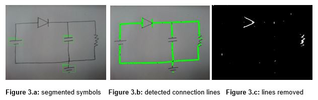
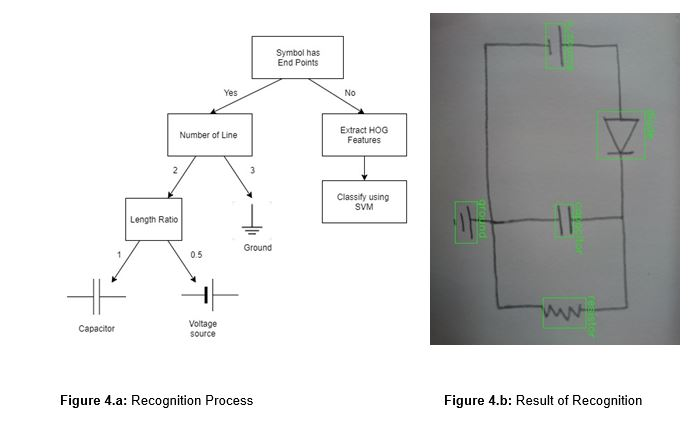
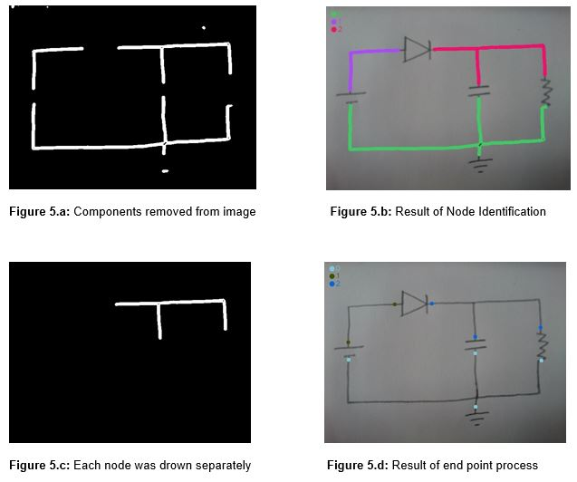
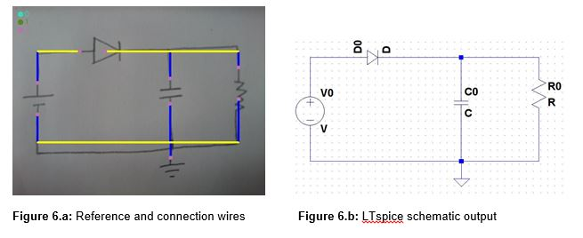
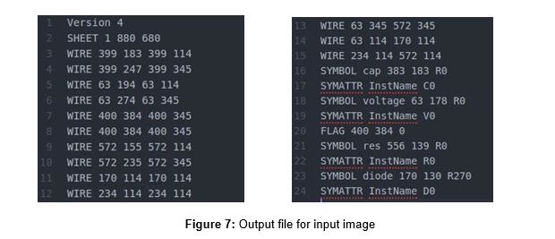
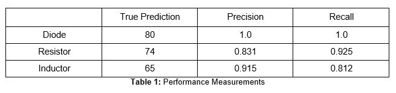

# Hand-drawn Circuit Recognizer

## Abstract
An electrical circuit is mainly composed of component symbols and their connections. This project proposes a system for automatic recognition of hand-drawn electrical circuits based on image segmentation and classification algorithms. Each component symbol is extracted from connection wires, then an identification process is applied to each symbol. The output of system is a netlist that identifies the symbol types and interconnections between them. The netlist can be used to create computer schematic of circuit.

## Introduction
Circuit simulation programs are very efficient and fast way of observing behaviors of electrical circuits. They are fundamental tools for engineers to analyze characteristics of circuits and get simulation results. To use the benefits of simulation programs, engineers need circuit schematic which contains components and interconnections between them. The simulation programs provide a graphical interface to create circuit schematics. However, it’s popular to create initial concepts of electrical circuits using pencil and paper for engineers. Because of that, engineers spend additional time to transform hand-drawn circuit to required schematic file of simulation program. This project explains a method to create schematic file from hand-drawn circuit sketch. 
There are some challenges in circuit sketch recognition such as segmentation of components, recognition of components and getting interconnections between them. Some earlier researches are available to solve these problems [1][2][3]. A system uses block adjacency graph (BAG) to segment components, then it identifies components using a contour based classification [1]. Another system extracts potential connection lines and potential components using some assumptions about lines and components [2]. A project describes a system that makes an analysis to obtain branches and end points of components, then it uses Fourier descriptor of component region to make SVM classification [3].
This project proposes a way to segment components and connection wires using combination of end point analysis and line detection, then it describes component region using HOG features. It recognizes components using SVM classification. An overview of our project shown Figure 1.

  

  
<b>Figure 1:</b> Block diagram of project

## Problem Definition
The aim of this project is to recognize hand-drawn circuit sketch. There are some main steps of project. Firstly, we need to make segmentation of component symbols and connection wires between them. This is a crucial step of project to recognize symbols and determine nodes of circuit. If we don’t segment symbols properly, recognition process will fail to identify components. The segmentation faults can also cause multiple segment for a single symbol or it can segment a connection line as a component symbol. Secondly, there should be a recognition process to identify symbols extracted from segmentation process. The recognition process should identify symbols correctly, and it should also be fast enough to give quick response to user. It can make wrong classification of symbols so recognition process should provide a way to handle this problem for user. After recognition process, we need to get nodes of circuit using relation between recognized symbols and connection wires. Nodes of circuit can provide required information for us to create a netlist. The netlist is necessary to get computer schematic for circuit simulation programs like ltspice, pspice. 

## Proposed Solution

A circuit sketch is composed of component symbols and connection lines. We made some limitations and assumptions about circuit sketch. First of all, we limited types of components that a circuit sketch can contain. Because, each symbol needs a specified recognizer which is trained with a dataset. Our interest is limited to capacitor, inductor, diode, resistor, voltage source and ground components. We also made some assumptions listed below [2].

1.	Connection lines are horizontal and vertical wires
1.	Open lines belong to a component symbol such as capacitor, ground.

These assumptions make easier to segment symbols and connection wires.

Circuit recognition task consist of segmentation of component symbols, recognition of symbols and creating output netlist file steps. We preprocessed input circuit sketch to obtain binary image which is more suitable format to apply segmentation process. We converted color (RGB) input image to grayscale image, and then we applied a Gaussian filter to smooth image. Binary image was obtained using adaptive thresholding. In this way, we reduced effects of illumination changes on input image. Then we applied thinning operation to obtain skeleton of circuit sketch. Skeleton image can provide to detect end points which indicates an open line stand there. Figure 2 shows results of binarization and thinning processes.  

 

 
Skeleton image has one pixel line thickness. If we count number of foreground neighbors of each foreground pixel, we can find end points which has only one foreground neighbor pixel [3]. Figure 2.d shows end points of input image. End points lead us to segment capacitor, voltage source and ground symbols due to open lines they contain. We don’t need a trained recognizer for these components because we know that capacitor, voltage source, ground components differ from each other in the two cases, length ratio of lines, number of line they have. We can identify them using these properties. Capacitor has two lines with length ratio about 1, and voltage source has two lines with length ratio about 0.5. Ground has different number of lines than other components. Figure 3.a shows segmented voltage source, capacitor and ground components by using these properties.

 

Assumption (1) states that connection lines are horizontal and vertical lines. We detected these lines using line segment detector algorithm [4]. Then, we removed detected connection lines  and segmented components from adaptive thresholding image shown Figure 2.b. Above Figure 3.c shows result of removing operation. Morphological closing operation was applied to make image suitable for contour detection algorithm [5]. It returns separated foreground regions. We ignored small regions with thresholding contours by region area because they are probably remaining part of connection lines or noise due to illumination differences. Remaining regions are potential circuit components that can be identified by recognition process.

Figure 4.a shows general procedure of circuit sketch recognition. We obtained some of circuit components using end point analysis. However, we need to classify remaining component regions. To achieve this, we trained SVM classifier that can classify a given input into one of resistor, diode or inductor components. We created a dataset that contains a hundred image of each component. 80% of dataset was separated for training and remaining of dataset for test purposes. HOG features was used to obtain feature vector of each training sample. HOG algorithm uses gradient magnitude and direction of each pixel to create feature vector that describes a region of image. It’s rotation and scale invariant feature description algorithm. It’s popular to use HOG features with SVM classification [6]. HOG feature vector and label of each training sample was used to train SVM. SVM is a popular classification algorithm. It interprets feature vectors as a point in a high dimensional space. Points belong to same component stand together at high dimensional space so SVM algorithm tries to fit a hyperplane that separates one component label from others. Figure 4.b shows the result of SVM classification.

 

We identified all components present in input image. After that, we tried to identify nodes of the input circuit. We removed all component regions from binary image because this made each node separate from each other. We applied contour finding algorithm to find each node as a region on image. Then, we drew each region to a new empty image, and found end points of each node using similar process as mentioned before. End points of each node matched component bounding boxes so we got which component connected which nodes of circuit.  Figure 5 shows steps of node identification process.  

 

We chose LTspice as our output simulation program so we need to create an output file compatible with LTspice .asc schematic file. A list that indicates which component connected which nodes of circuit is not enough to get schematic file of circuit. We should have coordinates of all lines present in circuit, and resize all components to make them suitable for LTspice predefined component size. We develop a method to get line segment present in circuit. Line segment detector [4] was used to find lines of each node. Then, we assigned a line as a reference line for each node, and determine remaining lines according to this reference line because there may be multiple component connected to a node of circuit or single line from component to node is not enough to describe actual connection. We also updated all components node coordinates to make them suitable for LTspice. Figure 6.a shows reference lines as yellow lines and remaining lines as blue lines which indicates connection from component to node.

 

 
 ## Results
 
 The final result of project is shown Figure 6.b. LTspice schematic of input circuit was created from Figure 6.a. LTspice creates .asc file for circuit schematic. We arranged component size and wire connections suitable for LTspice. Figure 7 shows output .asc file corresponding to input hand-drawn circuit. Each connection in circuit corresponds WIRE x1 y1 x2 y2 code line that is generated automatically. Each component in circuit corresponds SYMBOL symbol_name x y rotation_angle code line. LTspice schematic file can also contain component values. However, we didn’t deal with text recognition task in this project so we didn’t get any component value from input circuit. We may assign default value for each component like 1kΩ for resistor, 1uF for capacitor. There may be a text recognition process to get component values from user in future works. 
 
We limited our attention to six component in this project due to data requirement for each component. The number of component may be insufficient for reel case circuit drawing. A dataset that include more component can expand supported components library of our project. We can handle more complex circuit schematics in that way. We may add transistor and op-amp which are critical components for most of electronic circuit.

Segmentation and classification are main challenges of this project. There may be errors due to segmentation problems and wrong recognition of component symbols. Because of that, a stable solution for project needs user interaction. If there is wrong classified component,we should provide a manual way to fix problem for user. If there is missing component, user can have a chance to select missing component for classification.

 

There are two parameters to measure prediction performance of classification process. They are precision and recall. These parameters was calculated using test set which is equal to 20% of total dataset. Each test sample was rotated 90 degree three times to obtain different rotations of component so we have 80 test sample of each component label. The result of performance measurements for each component is given below.

 

## Conclusion

In this project, we developed a method that transform hand-drawn circuit to LTspice schematic. This method takes input circuit image, and applies some algorithms to get binary image. It uses binary image to segment components that consist horizontal and vertical lines like capacitor, ground and voltage source. Then, it applies contour finding algorithm to get remaining component regions. A trained classifier model identifies each component. After segmentation and classification of components, there is a process to find nodes of circuit and connection wires. Identified components are removed from binary image, and each node represent different region after removing operation. Our method uses end points of each node to determine which component connected to this node. It has a process to detect connection wires, and resize each component for compatibility with LTspice format. It creates output LTspice schematic file using coordinates of each component and connection wire.

In conclusion, we built a system to transform circuit sketch to computer schematic that support limited number of component.  

### References

1. Bin Yu (1995). Automatic understanding of symbol-connected diagrams
1. Yuhong Yu , A. Samal , S.C. Seth (1995), A System for Recognizing a Large Class of Engineering Drawings 
1. Yuchi Liu, Yao Xiao (2014), Circuit Sketch Recognition
1. Rafael Grompone von Gioi, Jérémie Jakubowicz, Jean-Michel Morel, and Gregory Randall (2012), LSD: a Line Segment Detector, Image Processing on Line, pp. 35–55.
1. https://docs.opencv.org/3.3.1/d4/d73/tutorial_py_contours_begin.html
1. Navneet Dalal, Bill Triggs (2005), Histograms of Oriented Gradients for Human Detection

